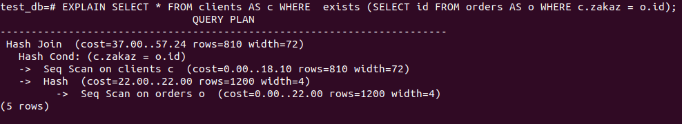

# Домашнее задание к занятию "6.2. SQL"

## Введение

Перед выполнением задания вы можете ознакомиться с 
[дополнительными материалами](https://github.com/netology-code/virt-homeworks/tree/master/additional/README.md).

## Задача 1

Используя docker поднимите инстанс PostgreSQL (версию 12) c 2 volume, 
в который будут складываться данные БД и бэкапы.

Приведите получившуюся команду или docker-compose манифест.

```shell
version: '3.3'
services:
  db:
    image: postgres:12-alpine
    restart: always
    environment:
      - POSTGRES_USER=postgres
      - POSTGRES_PASSWORD=postgres
    ports:
      - '5432:5432'
    volumes:
      - ./db:/var/lib/postgresql/data
      - ./db_backup:/var/lib/postgresql/data_backup
    network_mode: bridge
```


## Задача 2

В БД из задачи 1: 
- создайте пользователя test-admin-user и БД test_db
- в БД test_db создайте таблицу orders и clients (спeцификация таблиц ниже)
- предоставьте привилегии на все операции пользователю test-admin-user на таблицы БД test_db
- создайте пользователя test-simple-user  
- предоставьте пользователю test-simple-user права на SELECT/INSERT/UPDATE/DELETE данных таблиц БД test_db

Таблица orders:
- id (serial primary key)
- наименование (string)
- цена (integer)

Таблица clients:
- id (serial primary key)
- фамилия (string)
- страна проживания (string, index)
- заказ (foreign key orders)

Приведите:
- итоговый список БД после выполнения пунктов выше:


- описание таблиц (describe):

  
    

- SQL-запрос для выдачи списка пользователей с правами над таблицами test_db:

```shell
SELECT * from information_schema.table_privileges where grantee in ('test-admin-user', 'test-simple-user');

```


- список пользователей с правами над таблицами test_db:
  
  

## Задача 3

Используя SQL синтаксис - наполните таблицы следующими тестовыми данными:

Таблица orders

|Наименование|цена|
|------------|----|
|Шоколад| 10 |
|Принтер| 3000 |
|Книга| 500 |
|Монитор| 7000|
|Гитара| 4000|

Таблица clients

|ФИО|Страна проживания|
|------------|----|
|Иванов Иван Иванович| USA |
|Петров Петр Петрович| Canada |
|Иоганн Себастьян Бах| Japan |
|Ронни Джеймс Дио| Russia|
|Ritchie Blackmore| Russia|

Используя SQL синтаксис:
- вычислите количество записей для каждой таблицы:

     


- приведите в ответе:
    - запросы:
```shell
INSERT INTO orders (order_name, order_price) VALUES ('Шоколад', 10), ('Принтер', 3000), ('Книга', 500), ('Монитор', 7000), ('Гитара', 4000);

INSERT INTO clients (surname, country) VALUES ('Иванов Иван Иванович', 'USA'), ('Петров Петр Петрович', 'Canada'), ('Иоганн Себастьян Бах', 'Japan'), ('Ронни Джеймс Дио','Russia'), ('Ritchie Blackmore', 'Russia');
```

  - результаты выполнения: 
```shell

test_db=# SELECT * FROM orders;
 id | order_name | order_price 
----+------------+-------------
  1 | Шоколад    |          10
  2 | Принтер    |        3000
  3 | Книга      |         500
  4 | Монитор    |        7000
  5 | Гитара     |        4000
(5 rows)

test_db=# SELECT * FROM clients;
 id |       surname        | country | zakaz 
----+----------------------+---------+-------
  1 | Иванов Иван Иванович | USA     |      
  2 | Петров Петр Петрович | Canada  |      
  3 | Иоганн Себастьян Бах | Japan   |      
  4 | Ронни Джеймс Дио     | Russia  |      
  5 | Ritchie Blackmore    | Russia  |      
(5 rows)


```

## Задача 4

Часть пользователей из таблицы clients решили оформить заказы из таблицы orders.

Используя foreign keys свяжите записи из таблиц, согласно таблице:

|ФИО|Заказ|
|------------|----|
|Иванов Иван Иванович| Книга |
|Петров Петр Петрович| Монитор |
|Иоганн Себастьян Бах| Гитара |

Приведите SQL-запросы для выполнения данных операций: 

```shell
UPDATE clients SET zakaz = 3 WHERE id = 1;
UPDATE clients SET zakaz = 4 WHERE id = 2;
UPDATE clients SET zakaz = 5 WHERE id = 3;
```

Приведите SQL-запрос для выдачи всех пользователей, которые совершили заказ, а также вывод данного запроса: 

```shell
SELECT * FROM clients AS c WHERE  exists (SELECT id FROM orders AS o WHERE c.zakaz = o.id);
```


 
Подсказка - используйте директиву `UPDATE`.

## Задача 5

Получите полную информацию по выполнению запроса выдачи всех пользователей из задачи 4 
(используя директиву EXPLAIN).

Приведите получившийся результат и объясните что значат полученные значения.



Здесь планировщик решил использовать хэш-соединение, при котором строки одной таблицы вводятся в хэш-таблицу в памяти,
после чего сканируется другая таблица и проверяется хэш-таблица на предмет совпадений с каждой строкой.

EXPLAIN сообщает, что используется Seq Scan — последовательное чтение данных таблиц clients и orders.

_cost_ - первое значение 0.00 — затраты на получение первой строки, второе — 18.10 и 22.00  — затраты на получение 
всех строк таблиц clients и orders соответственно.

_rows_ — приблизительное количество возвращаемых строк при выполнении операции Seq Scan.

_width_ — средний размер одной строки в байтах.

Но наши таблицы не содержат такое количество строк, которое выдал EXPLAIN (810 для clients, 1200 для orders).

Для обновления статистики вызываем команду ANALYZE и получим реальное значения rows. 


## Задача 6

Создайте бэкап БД test_db и поместите его в volume, предназначенный для бэкапов (см. Задачу 1).

```shell
bash-5.1# pg_dump -U postgres test_db -f /var/lib/postgresql/data_backup/test_db_dump.sql
```

Остановите контейнер с PostgreSQL (но не удаляйте volumes):

```shell
docker-compose down
```

Поднимите новый пустой контейнер с PostgreSQL:

```shell
version: '3.3'
services:
  db:
    image: postgres:12-alpine
    restart: always
    environment:
      - POSTGRES_USER=postgres
      - POSTGRES_PASSWORD=postgres
    ports:
      - '5432:5432'
    volumes:
      - ./db_backup:/var/lib/postgresql/data_backup
    network_mode: bridge
```

```shell
docker-compose build
docker-compose up
```


Восстановите БД test_db в новом контейнере:

```shell
dmitry@dmitry-N56VZ:~/PycharmProjects/docker/postgres$ docker ps
CONTAINER ID   IMAGE                COMMAND                  CREATED          STATUS          PORTS                    NAMES
7ee424374978   postgres:12-alpine   "docker-entrypoint.s…"   16 seconds ago   Up 14 seconds   0.0.0.0:5432->5432/tcp   postgres_db_1
dmitry@dmitry-N56VZ:~/PycharmProjects/docker/postgres$ docker exec -it 7ee424374978 bash

bash-5.1# cd /var/lib/postgresql/data_backup
bash-5.1# pwd
/var/lib/postgresql/data_backup

bash-5.1# psql -U postgres

postgres=# CREATE DATABASE test_bd;
postgres=# \q

bash-5.1# psql -U postgres -d  test_bd < test_db_dump.sql
SET
SET
SET
SET
SET
 set_config 
------------
 
(1 row)

SET
SET
SET
SET
SET
SET
CREATE TABLE
ALTER TABLE
CREATE SEQUENCE
ALTER TABLE
ALTER SEQUENCE
CREATE TABLE
ALTER TABLE
CREATE SEQUENCE
ALTER TABLE
ALTER SEQUENCE
ALTER TABLE
ALTER TABLE
COPY 5
COPY 5
 setval 
--------
      5
(1 row)

 setval 
--------
      5
(1 row)

ALTER TABLE
ALTER TABLE
CREATE INDEX
ALTER TABLE
ERROR:  role "test-admin-user" does not exist
ERROR:  role "test-simple-user" does not exist
ERROR:  role "test-admin-user" does not exist
ERROR:  role "test-simple-user" does not exist


postgres=# \c test_bd 
You are now connected to database "test_bd" as user "postgres".
test_bd=# \dt
          List of relations
 Schema |  Name   | Type  |  Owner   
--------+---------+-------+----------
 public | clients | table | postgres
 public | orders  | table | postgres
(2 rows)
```


Приведите список операций, который вы применяли для бэкапа данных и восстановления. 

---

### Как cдавать задание

Выполненное домашнее задание пришлите ссылкой на .md-файл в вашем репозитории.

---
