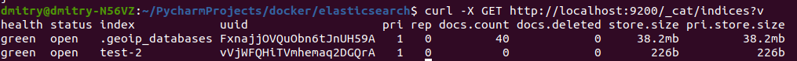
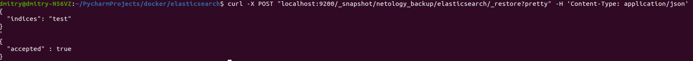

# Домашнее задание к занятию "6.5. Elasticsearch"

## Задача 1

В этом задании вы потренируетесь в:
- установке elasticsearch
- первоначальном конфигурировании elastcisearch
- запуске elasticsearch в docker

Используя докер образ [elasticsearch:7](https://hub.docker.com/_/elasticsearch) как базовый:

- составьте Dockerfile-манифест для elasticsearch
- соберите docker-образ и сделайте `push` в ваш docker.io репозиторий
- запустите контейнер из получившегося образа и выполните запрос пути `/` c хост-машины

Требования к `elasticsearch.yml`:
- данные `path` должны сохраняться в `/var/lib` 
- имя ноды должно быть `netology_test`

В ответе приведите:
- текст Dockerfile манифеста
```shell
FROM elasticsearch:7.17.3

MAINTAINER kuchukov.d

COPY elasticsearch.yml /usr/share/elasticsearch/config/

RUN mkdir /var/lib/logs \
    && chown -R elasticsearch:elasticsearch /var/lib/logs \
    && mkdir /var/lib/data \
    && chown -R elasticsearch:elasticsearch /var/lib/data

USER elasticsearch

ENV PATH=$PATH:/usr/share/elasticsearch/bin

CMD ["elasticsearch"]

EXPOSE 9200 9300

```
- ссылка на образ в репозитории dockerhub

```shell
https://hub.docker.com/r/kuzmich84/my-elastic-image-repo
```

- ответ `elasticsearch` на запрос пути `/` в json виде:


Подсказки:
- при сетевых проблемах внимательно изучите кластерные и сетевые настройки в elasticsearch.yml
- при некоторых проблемах вам поможет docker директива ulimit
- elasticsearch в логах обычно описывает проблему и пути ее решения
- обратите внимание на настройки безопасности такие как `xpack.security.enabled` 
- если докер образ не запускается и падает с ошибкой 137 в этом случае может помочь настройка `-e ES_HEAP_SIZE`
- при настройке `path` возможно потребуется настройка прав доступа на директорию

Далее мы будем работать с данным экземпляром elasticsearch.

## Задача 2

В этом задании вы научитесь:
- создавать и удалять индексы
- изучать состояние кластера
- обосновывать причину деградации доступности данных

Ознакомтесь с [документацией](https://www.elastic.co/guide/en/elasticsearch/reference/current/indices-create-index.html) 
и добавьте в `elasticsearch` 3 индекса, в соответствии со таблицей:

| Имя | Количество реплик | Количество шард |
|-----|-------------------|-----------------|
| ind-1| 0 | 1 |
| ind-2 | 1 | 2 |
| ind-3 | 2 | 4 |

Получите список индексов и их статусов, используя API и **приведите в ответе** на задание.


Получите состояние кластера `elasticsearch`, используя API.


Как вы думаете, почему часть индексов и кластер находится в состоянии yellow?

Yellow статус означает, что существует риск потери данных, если с шардами что-то пойдет не так. 
Так как в нашем случае не хватает количества реплик. 

Удалите все индексы.


**Важно**

При проектировании кластера elasticsearch нужно корректно рассчитывать количество реплик и шард,
иначе возможна потеря данных индексов, вплоть до полной, при деградации системы.

## Задача 3

В данном задании вы научитесь:
- создавать бэкапы данных
- восстанавливать индексы из бэкапов

Создайте директорию `{путь до корневой директории с elasticsearch в образе}/snapshots`.

Используя API [зарегистрируйте](https://www.elastic.co/guide/en/elasticsearch/reference/current/snapshots-register-repository.html#snapshots-register-repository) 
данную директорию как `snapshot repository` c именем `netology_backup`.

**Приведите в ответе** запрос API и результат вызова API для создания репозитория.


Создайте индекс `test` с 0 реплик и 1 шардом и **приведите в ответе** список индексов.


[Создайте `snapshot`](https://www.elastic.co/guide/en/elasticsearch/reference/current/snapshots-take-snapshot.html) 
состояния кластера `elasticsearch`.


**Приведите в ответе** список файлов в директории со `snapshot`ами.


Удалите индекс `test` и создайте индекс `test-2`. **Приведите в ответе** список индексов.




[Восстановите](https://www.elastic.co/guide/en/elasticsearch/reference/current/snapshots-restore-snapshot.html) состояние
кластера `elasticsearch` из `snapshot`, созданного ранее. 

**Приведите в ответе** запрос к API восстановления и итоговый список индексов.




Подсказки:
- возможно вам понадобится доработать `elasticsearch.yml` в части директивы `path.repo` и перезапустить `elasticsearch`

---

### Как cдавать задание

Выполненное домашнее задание пришлите ссылкой на .md-файл в вашем репозитории.

---
