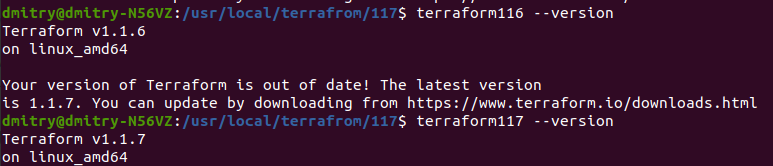

# Домашнее задание к занятию "7.1. Инфраструктура как код"

## Задача 1. Выбор инструментов.

### В результате задачи необходимо

A. Ответить на четыре вопроса представленных в разделе "Легенда". 

1. Какой тип инфраструктуры будем использовать для этого проекта: изменяемый или не изменяемый?

    Будем использовать неизменяемый тип, так как инфраструктура этого типа более согласована, надежная, 
проста и предсказуема в процессе развертывания, чем изменяемая.

2. Будет ли центральный сервер для управления инфраструктурой?

    Не будет, так как это дополнительные накладные расходы. 

3. Будут ли агенты на серверах?

    Агентов не будет, так как Ansible, CloudFormation и Terraform не требует установки каких-либо агентов.

4. Будут ли использованы средства для управления конфигурацией или инициализации ресурсов? 

    Будем использовать, так как может значительно улучшить целостность данных на серверах, 
    автоматизируя процессы и отслеживая изменения.

B. Какие инструменты из уже используемых вы хотели бы использовать для нового проекта? 

 Связку Terraform + Packer + Docker, так как Terraform активно используют уже год, 
есть опыт в работе с Packer и разработчики привыкли использовать Docker.

На данный момент нет, так как начинать проект необходимо как можно скорее,  но в дальнейшем возможно. 

C. Хотите ли рассмотреть возможность внедрения новых инструментов для этого проекта?

    

Если для ответа на эти вопросы недостаточно информации, то напишите какие моменты уточните на совещании.

## Задача 2. Установка терраформ. 

## Задача 3. Поддержка легаси кода. 

---

### Как cдавать задание

Выполненное домашнее задание пришлите ссылкой на .md-файл в вашем репозитории.

---
