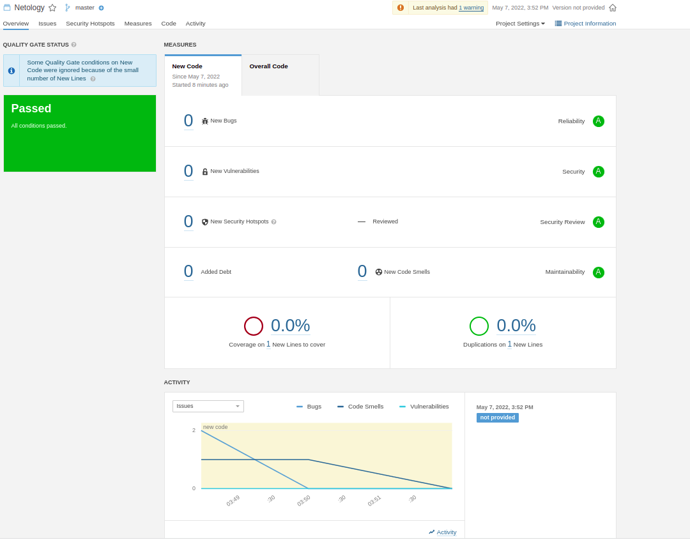

# Домашнее задание к занятию "09.02 CI\CD"

## Знакомоство с SonarQube



## Знакомство с Nexus

В ответе присылаем файл `maven-metadata.xml` для этого артефекта

Файл [maven-metadata.xml](./nexus/maven-metadata.xml)


### Знакомство с Maven


### Основная часть

```shell
dmitry@dmitry-N56VZ:~/.m2/repository$ ls -l | grep netology
drwxrwxr-x 3 dmitry dmitry 4096 мая  7 18:54 netology
```

 Файл  [pom.xml](./mvn/pom.xml)

---

### Как оформить ДЗ?

Выполненное домашнее задание пришлите ссылкой на .md-файл в вашем репозитории.

---
